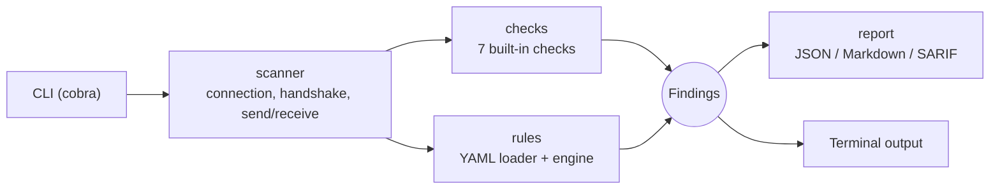

<div align="center">

<p align="center">
  
</p>

# Wadjet

**An open-source WebSocket security scanner for authorized testing and education.**

[](https://go.dev/)
[](LICENSE)
[](#reporting)
[](#safety-and-ethics)

[Features](#features) · [Install](#installation) · [Usage](#usage) · [Checks](#built-in-checks) · [Rules](#custom-yaml-rules) · [Reporting](#reporting) · [Test server](#local-test-server)

</div>

---

> ⚠️ **Legal notice.** Wadjet is for **authorized security testing and education only**. Only scan systems you own or have explicit written permission to test. You are responsible for how you use this tool. Wadjet prints this warning on every scan.

## Why Wadjet

WebSockets bypass much of the tooling and habits people rely on for regular HTTP. Authentication, origin validation and rate limiting are often forgotten on the `ws://` endpoint even when the rest of the application is locked down. Common problems include:

- **Cross-Site WebSocket Hijacking (CSWSH)**, where a malicious page opens an authenticated socket in a victim's browser because the server never checks the `Origin` header.
- **Unauthenticated sockets** that expose internal events or data.
- **Tokens in the URL**, which leak into logs, browser history and referrers.
- **No limits** on message rate or size, which opens the door to abuse.
- **Verbose errors** that leak stack traces and internal paths.

Wadjet checks for these issues quickly and safely, then produces reports you can read, share or load into CI.

Named after the Egyptian cobra goddess who guards and watches over, Wadjet is built as a defensive tool: it finds the weak spots so you can fix them.

## Features

- 🔍 **7 built-in checks** for common WebSocket weaknesses
- 🧩 **YAML rule engine** to write your own checks without touching Go code
- 📄 **JSON, Markdown and SARIF 2.1.0** reports, ready for GitHub code scanning
- 🎨 **Color-coded terminal output** with a summary line
- 🚦 **CI-friendly exit codes**: non-zero when a high-severity finding exists
- 🛡️ **Non-destructive by design**: low volume, no exploitation, no data modification
- 🧪 **Bundled vulnerable test server** (localhost only) for safe practice and integration tests
- 📦 **Minimal dependencies**: cobra, gorilla/websocket, yaml.v3 and the standard library

## Installation

**Requirements:** Go 1.21 or newer.

```bash
git clone https://github.com/PYRAMID-SEC/wadjet.git
cd wadjet
make build
```

The binary is built from `cmd/wadjet`. You can also build it directly:

```bash
go build -o wadjet ./cmd/wadjet
```

Check the install:

```bash
./wadjet version
```

## Usage

```bash
wadjet scan -u <ws/wss url> [flags]
```

### Quick start

```bash
# Scan a WebSocket endpoint with all built-in checks
wadjet scan -u wss://example.com/socket

# Pass an auth header and write a Markdown report
wadjet scan -u wss://example.com/socket \
  -H "Authorization: Bearer <token>" \
  --format markdown -o report.md

# Run only specific checks
wadjet scan -u wss://example.com/socket --checks origin-validation,no-auth

# Add your own YAML rules
wadjet scan -u wss://example.com/socket --rules ./rules

# Export SARIF for CI
wadjet scan -u wss://example.com/socket --format sarif -o wadjet.sarif
```

### Flags

| Flag | Description |
|------|-------------|
| `-u`, `--url` | Target `ws://` or `wss://` URL (required) |
| `-H`, `--header` | Extra request header, repeatable (`-H "Name: value"`) |
| `--checks` | Comma-separated list of check IDs to run (default: all) |
| `--rules` | Directory containing custom `*.yaml` rules |
| `-o`, `--output` | Write the report to a file |
| `--format` | Report format: `json`, `markdown` or `sarif` |
| `--timeout` | Per-operation timeout |
| `--insecure` | Skip TLS certificate verification |
| `--verbose` | Show extra detail while scanning |

### Exit codes

| Code | Meaning |
|------|---------|
| `0` | Scan finished with no high-severity findings |
| `1` | At least one high-severity finding |

## Built-in checks

Each check returns a finding with an ID, title, severity, description, evidence and remediation advice.

| ID | What it does | Severity |
|----|--------------|----------|
| `origin-validation` | Attempts the handshake with `Origin: https://evil.example`. A `101` response indicates possible Cross-Site WebSocket Hijacking. | High |
| `no-auth` | Connects without credentials or cookies. A successful connection means unauthenticated access. | High |
| `token-in-url` | Flags tokens or keys placed in the query string. | Medium |
| `insecure-transport` | Flags plain `ws://` instead of `wss://`. | Medium |
| `rate-limit` | Sends a small burst of messages (50 by default, configurable). If the server never throttles or closes the connection, rate limiting is likely missing. | Medium |
| `message-size` | Sends one oversized message (about 1 MB). If accepted, no size limit is likely enforced. | Medium |
| `verbose-errors` | Sends malformed JSON and looks for stack traces or internal paths in the response. | Low |

All checks are intentionally gentle: low message volume, no exploitation, no data changes.

## Custom YAML rules

Add your own checks by dropping `*.yaml` files in a directory and passing it with `--rules`. Rules are validated on load, and errors are reported clearly.

**Rule fields:** `id`, `name`, `severity`, `description`, `request` (headers, messages), `matchers` (status, body-contains, regex), `remediation`.

```yaml
id: custom-debug-endpoint
name: Debug command exposed over WebSocket
severity: medium
description: >
  The server responds to a debug message, which may expose internal state.
request:
  headers:
    X-Example: wadjet
  messages:
    - '{"action":"debug"}'
matchers:
  - body-contains: "stack"
  - regex: "(?i)internal[_ ]state"
remediation: >
  Remove debug handlers from production builds or restrict them to
  authenticated administrators.
```

Three ready-made examples live in the [`rules/`](rules/) directory.

## Reporting

| Format | Best for |
|--------|----------|
| **Terminal** | Quick feedback, with severity colors (red high, orange medium, yellow low) and a summary line |
| **JSON** | Scripting and further processing |
| **Markdown** | Readable reports: a summary table plus details for each finding |
| **SARIF 2.1.0** | GitHub code scanning and other security dashboards |

Example CI step that uploads results to GitHub code scanning:

```yaml
- name: Scan WebSocket endpoint
  run: ./wadjet scan -u wss://staging.example.com/socket --format sarif -o wadjet.sarif
  continue-on-error: true

- name: Upload SARIF
  uses: github/codeql-action/upload-sarif@v3
  with:
    sarif_file: wadjet.sarif
```

## Local test server

Wadjet ships with an **intentionally vulnerable** WebSocket server so you can practice and run integration tests safely. It has no origin check, no authentication, no rate limiting and verbose errors.

```bash
make run-testserver
# or
go run ./internal/testserver
```

It listens on **localhost only** and never binds to `0.0.0.0`. Then scan it:

```bash
./wadjet scan -u ws://localhost:<port>/ws
```

Check the server's startup output for the exact address and port.

> **Never expose the test server to a network.** It is vulnerable on purpose.

## Architecture



### Project structure

```
wadjet/
├── cmd/wadjet/          # CLI entry point
├── internal/
│   ├── scanner/         # connection, handshake, message send/receive
│   ├── checks/          # built-in security checks
│   ├── rules/           # YAML rule loader and engine
│   ├── report/          # JSON, Markdown, SARIF writers
│   └── testserver/      # intentionally vulnerable local server
├── rules/               # example YAML rules
├── assets/              # logo
├── Makefile
└── .github/workflows/   # CI
```

## Safety and ethics

Wadjet is built to be safe to run against systems you are authorized to test:

- A **legal warning banner** is shown on every scan.
- Checks are **non-destructive**: low volume, no exploitation, no data modification.
- Wadjet **only contacts the URL you provide**. It does not crawl, discover or scan anything else.
- It contains **no exploit code and no credential guessing**.
- Operations use **timeouts** so a scan can't hang indefinitely.

If you find a vulnerability with Wadjet, please follow responsible disclosure and report it to the system's owner.

## Development

```bash
make build            # build the binary
make test             # go test ./...
make lint             # go vet and linters
make run-testserver   # start the local vulnerable server
```

Contributions are welcome. See [CONTRIBUTING.md](CONTRIBUTING.md) for guidelines.

## Security

To report a vulnerability in Wadjet itself, see [SECURITY.md](SECURITY.md) or email **pyramidsec@gmail.com**.

## License

Released under the [MIT License](LICENSE).

## Author

**Ahmed Tarek Salah**, Cybersecurity Researcher, building at [PYRAMID-SEC](https://github.com/PYRAMID-SEC).

[](https://www.linkedin.com/in/ahmed-t-756505379/)
[](https://hackerone.com/thaqib)
[](https://github.com/PYRAMID-SEC)
